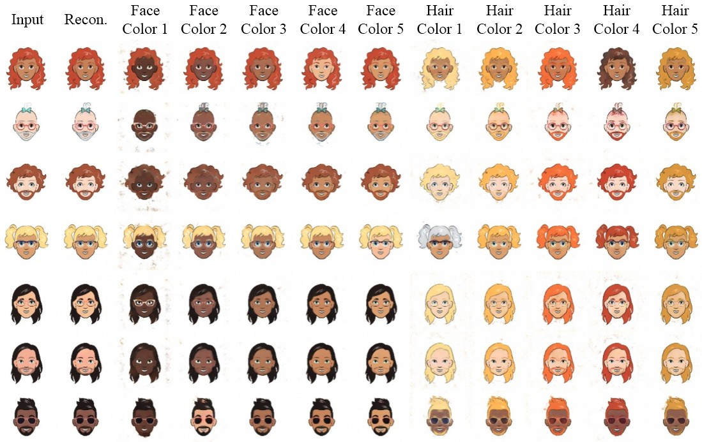

<p align="center">  </p>

<hr style="height:1px" />

# <p align="center"> [AttGAN](https://ieeexplore.ieee.org/document/8718508?source=authoralert)-Cartoon <br> <sub><sub> [TIP Nov. 2019](https://ieeexplore.ieee.org/document/8718508?source=authoralert), [arXiv Nov. 2017](https://arxiv.org/pdf/1711.10678v1.pdf) </sub></sub> </p>

*Example of using repo. [AttGAN-Tensorflow](https://github.com/LynnHo/AttGAN-Tensorflow) on a cartoon dataset. We make modifications to the files below to adapt the repo. [AttGAN-Tensorflow](https://github.com/LynnHo/AttGAN-Tensorflow) to the cartoon dataset. Please use a diff tool to show the differences of these files from the original ones in [AttGAN-Tensorflow](https://github.com/LynnHo/AttGAN-Tensorflow), then you can find out what modifications should we make to [AttGAN-Tensorflow](https://github.com/LynnHo/AttGAN-Tensorflow) for a **custom dataset**.*

- [data.py](./data.py)
- [train.py](./train.py)
- [test.py](./test.py), [test_multi.py](./test_multi.py), [test_slide.py](./test_slide.py)

<hr style="height:1px" />

## Usage

- Environment

    - Python 3.6

    - TensorFlow 1.15

    - OpenCV, scikit-image, tqdm, oyaml

    - *we recommend [Anaconda](https://www.anaconda.com/distribution/#download-section) or [Miniconda](https://docs.conda.io/en/latest/miniconda.html#linux-installers), then you can create the AttGAN environment with commands below*

        ```console
        conda create -n AttGAN python=3.6

        source activate AttGAN

        conda install -c anaconda tensorflow-gpu=1.15

        conda install -c anaconda opencv

        conda install -c anaconda scikit-image

        conda install -c anaconda tqdm

        conda install -c conda-forge oyaml
        ```

- Data Preparation

    - [Cartoon Set](https://google.github.io/cartoonset)

        - download [cartoonset10k.tgz](https://storage.cloud.google.com/cartoonset_public_files/cartoonset10k.tgz)  (move to **./data/cartoonset10k.tgz**)

        - unzip and process the data

            ```console
            cd ./data

            tar zxvf cartoonset10k.tgz

            python prepare_dataset.py
            ```

- Run AttGAN

    - *NOTICE: if you create a new conda environment, remember to activate it before any command*

        ```console
        source activate AttGAN
        ```

    - training

        ```console
        CUDA_VISIBLE_DEVICES=0 \
        python train.py \
        --load_size 143 \
        --crop_size 128 \
        --model model_128 \
        --experiment_name AttGAN_128
        ```

    - testing

        - **single** attribute editing (inversion)

            ```console
            CUDA_VISIBLE_DEVICES=0 \
            python test.py \
            --experiment_name AttGAN_128
            ```


        - **multiple** attribute editing (inversion) example

            ```console
            CUDA_VISIBLE_DEVICES=0 \
            python test_multi.py \
            --test_att_names face_color_0 hair_color_0 \
            --experiment_name AttGAN_128
            ```

        - attribute sliding example

            ```console
            CUDA_VISIBLE_DEVICES=0 \
            python test_slide.py \
            --test_att_name face_color_0 \
            --test_int_min -2 \
            --test_int_max 2 \
            --test_int_step 0.5 \
            --experiment_name AttGAN_128
            ```

    - loss visualization

        ```console
        CUDA_VISIBLE_DEVICES='' \
        tensorboard \
        --logdir ./output/AttGAN_128/summaries \
        --port 6006
        ```

    - convert trained model to .pb file

        ```console
        python to_pb.py --experiment_name AttGAN_128
        ```

## Citation

If you find [AttGAN](https://ieeexplore.ieee.org/document/8718508?source=authoralert) useful in your research work, please consider citing:

    @ARTICLE{8718508,
    author={Z. {He} and W. {Zuo} and M. {Kan} and S. {Shan} and X. {Chen}},
    journal={IEEE Transactions on Image Processing},
    title={AttGAN: Facial Attribute Editing by Only Changing What You Want},
    year={2019},
    volume={28},
    number={11},
    pages={5464-5478},
    keywords={Face;Facial features;Task analysis;Decoding;Image reconstruction;Hair;Gallium nitride;Facial attribute editing;attribute style manipulation;adversarial learning},
    doi={10.1109/TIP.2019.2916751},
    ISSN={1057-7149},
    month={Nov},}